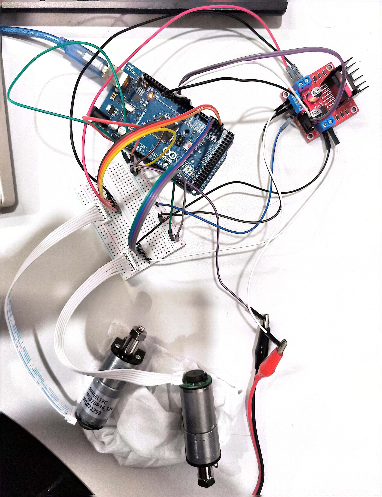
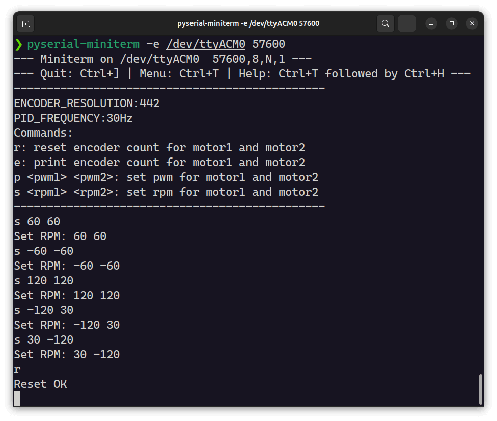

Arduino + L298N + Motor & Encoder = Speed Closed-Loop Control
> Code tested on Arduino Mega 2560

[English](README.md) | [中文](README_zh.md)

## Features
1. Serial port sends control commands, supporting the following 4 commands:
    - `r`: Reset encoder count, pause PID control
    - `e`: Print encoder count
    - `p <pwm1> <pwm2>`: Set PWM duty cycle, disable PID control
    - `s <rpm1> <rpm2>`: Set target speed, enable PID control
2. Use `timer` interrupt to trigger PID control function
3. Simple code, only two files `motor_control.ino` and `pid.h`

## Usage
### Wiring
> You can modify pin definitions in `setup()` function

Connect the hardware according to the following diagram, single motor connection diagram:

Actual circuit diagram:

### Command Interaction
After uploading the `motor_control.ino` code using the Arduion GUI, use the `pyserial-miniterm` tool in the terminal to communicate with the Arduino, installation method:
```bash
sudo apt install python3-serial  # for root
pip install pyserial # for pip
```
Start serial communication:
```bash
# Directly execute pyserial-miniterm to see all available serial ports
# Set the port to the serial port connected to your computer
pyserial-miniterm -e /dev/ttyACM0 57600
```
Then you can send commands through the serial port, for example:
```bash
# Print encoder count
e
# Reset encoder count, pause PID control
r
# Set PWM duty cycle to 50%, disable PID control
p 128 128
# Set target speed to 100rpm, enable PID control (ENCODER_RESOLUTION needs to be perfected)
s 100 100
```
### Calculate Encoder Resolution
Modify `ENCODER_RESOLUTION` in `motor_control.ino` to the resolution of the encoder, in units of encoder A or B port pulses per motor revolution, which can be obtained from the motor manual or estimated manually from the encoder output signal.

Estimation method: `r` to reset the encoder count, then `p 100 100` to record the number of motor revolutions N over a period of time, then `p 0 0` to stop the motor (if the motor does not return to the initial position, manually rotate the motor to the initial position), `e` to print the encoder count as M, then the encoder resolution is `int(M/N)`.

### Dual Motor Control Effect
Execute commands as follows:

Effect as follows:

https://github.com/user-attachments/assets/9477ec22-10fb-49e7-9185-63db84fb6377

https://github.com/user-attachments/assets/d94e3b33-25b1-4a39-bafd-ced19d181e7f


