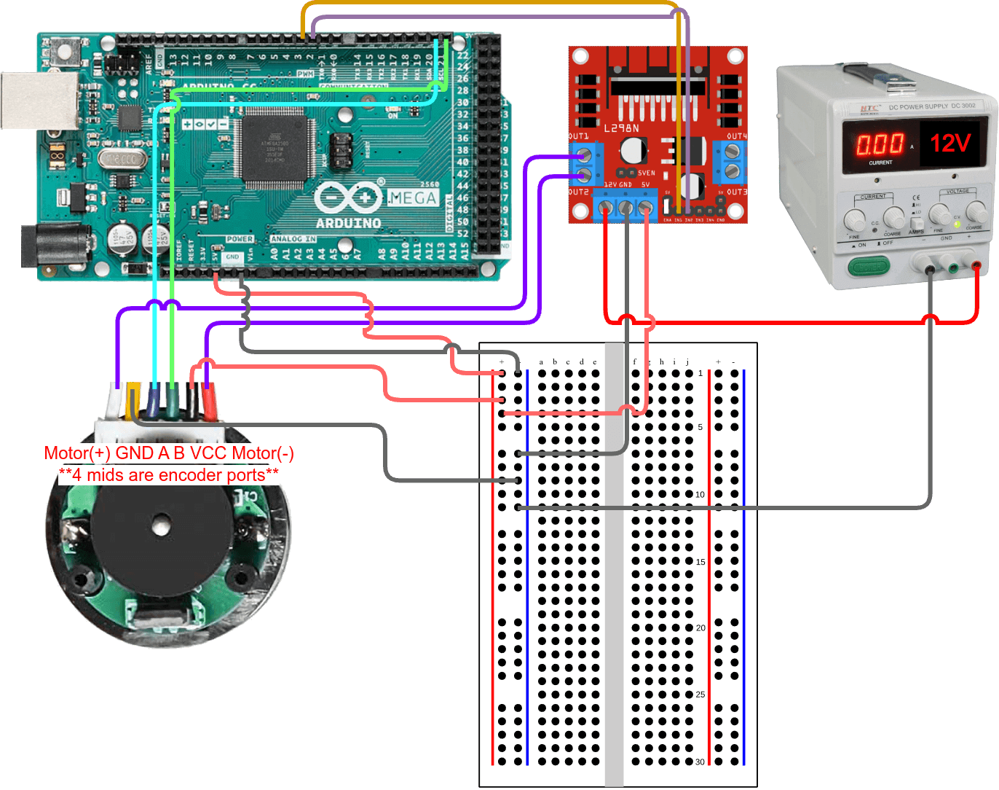
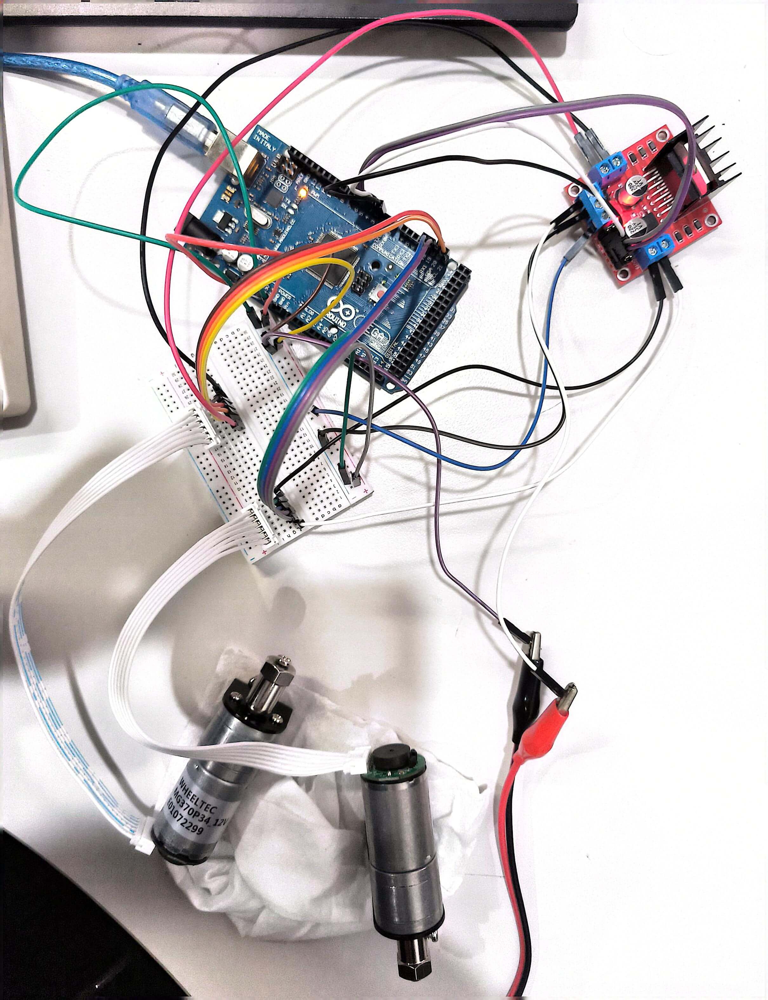
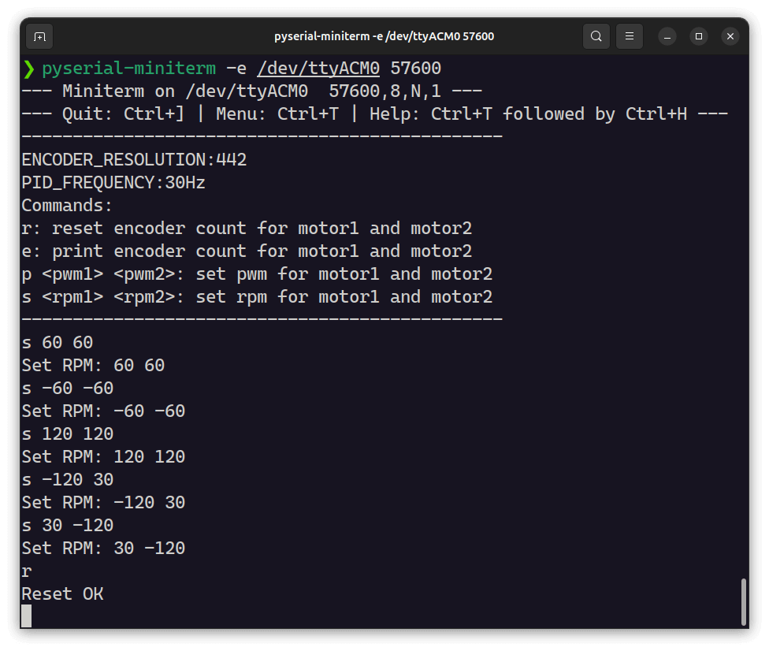

Arduino + L298N + 电机&编码器 = 速度闭环控制
> 代码在Arduino Mega 2560上测试通过

[English](README.md) | [中文](README_zh.md)

## 特点
1. 串口发送控制指令，支持如下4种指令:
    - `r`: 重置编码器计数，暂停PID控制
    - `e`: 打印编码器计数
    - `p <pwm1> <pwm2>`: 设置PWM占空比，关闭PID控制
    - `s <rpm1> <rpm2>`: 设置目标转速，启动PID控制
2. 使用`timer`中断触发PID控制函数
3. 代码简单，仅用两个文件`motor_control.ino`和`pid.h`

## 使用方法
### 连线
> 可以在`setup()`函数中修改引脚定义

按照下图连接硬件，单个电机连接电路图:

实际电路图:

### 命令交互
使用Arduion GUI烧录`motor_control.ino`代码后，使用终端里的`pyserial-miniterm`工具与Arduino通信，安装方法:
```bash
sudo apt install python3-serial  # for root
pip install pyserial # for pip
```
启动串口通信:
```bash
# 直接执行pyserial-miniterm可以看到所有可用的串口端口
# 设置端口为你电脑连接的串口端口
pyserial-miniterm -e /dev/ttyACM0 57600
```
然后就可以通过串口发送指令了，例如:
```bash
# 打印编码器计数
e
# 重置编码器计数，暂停PID控制
r
# 设置PWM占空比为50%，关闭PID控制
p 128 128
# 设置目标转速为100rpm，启动PID控制 (需完善ENCODER_RESOLUTION)
s 100 100
```
### 计算编码器分辨率
在`motor_control.ino`中修改`ENCODER_RESOLUTION`为编码器的分辨率，单位为编码器A或B端口脉冲数/电机转数，可以通过电机说明书获得，也可以手动通过编码器的输出信号估计得到。

估计方法: `r`重置编码器计数，然后`p 100 100`记录一段时间内电机转的圈数N，然后`p 0 0`停下电机（如果电机没有回到初始位置，需手动将电机转到初始位置），`e`打印编码器计数记为M，则编码器分辨率为`int(M/N)`。

### 双电机控制效果
执行命令如下:


效果如下:

https://github.com/user-attachments/assets/9477ec22-10fb-49e7-9185-63db84fb6377
